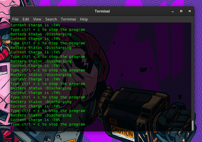

# battery-capacity-alert
your pc or laptop battery capacity alert program using python 
first run pip3 install requirements.txt  
then check your power_supply file location in your os and replace it in the program 
Like in mine it is present in /sys/class/power_supply/BAT0 or BAT1 in your case. 
After that run the program in root dir or change the dir to your current location to the power_supply dir in program 
then run python3 battery.py
<h3>What it does</h3>
the program gives an alert message at 90% and 95% while charging. 
the program gives an alert message at 5% and 10% while discharging.
<h3>screenshot of the program</h3>

